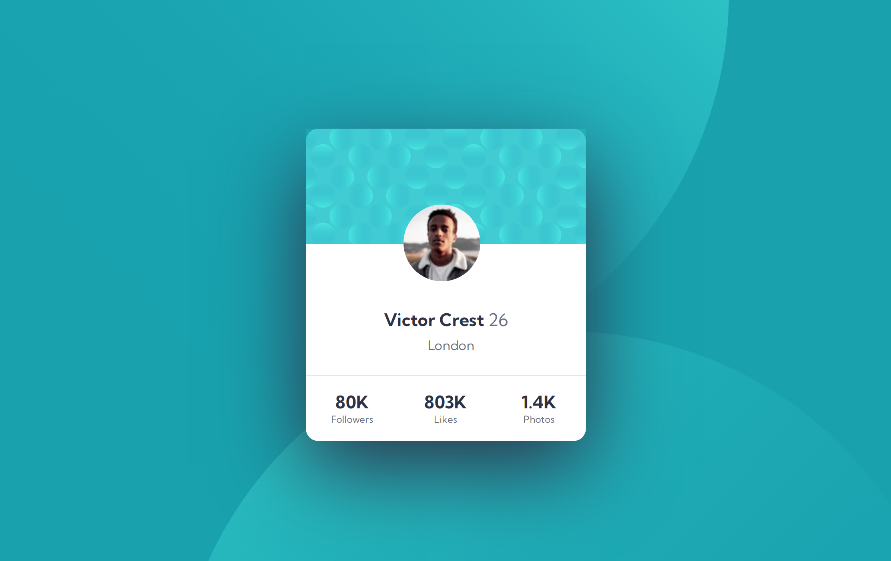

# Frontend Mentor - Profile card component solution

This is a solution to the [Profile card component challenge on Frontend Mentor](https://www.frontendmentor.io/challenges/profile-card-component-cfArpWshJ). Frontend Mentor challenges help you improve your coding skills by building realistic projects. 

## Table of contents

- [Overview](#overview)
  - [The challenge](#the-challenge)
  - [Screenshot](#screenshot)
  - [Links](#links)
- [My process](#my-process)
  - [Built with](#built-with)
  - [What I learned](#what-i-learned)
- [Author](#author)

## Overview

### The challenge

- Build out the project to the designs provided

### Screenshot

#### Desktop

#### Mobile

### Links

- Solution URL: [Github](https://github.com/AK-CHP1/fm_profile_card_component)
- Live Site URL: [Github Pages](https://ak-chp1.github.io/fm_profile_card_component)

### Built with

- Semantic HTML5 markup
- CSS custom properties
- Flexbox

## Author

- Name - Aayush Kumar
- Frontend Mentor - [@ak-chp1](https://www.frontendmentor.io/profile/ak-chp1)